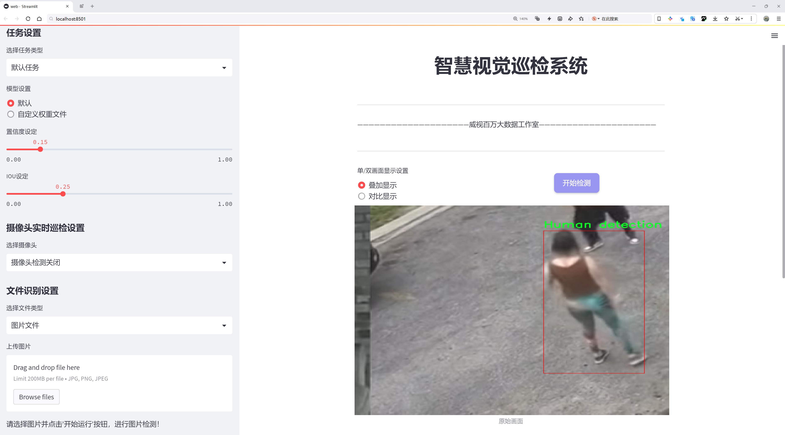
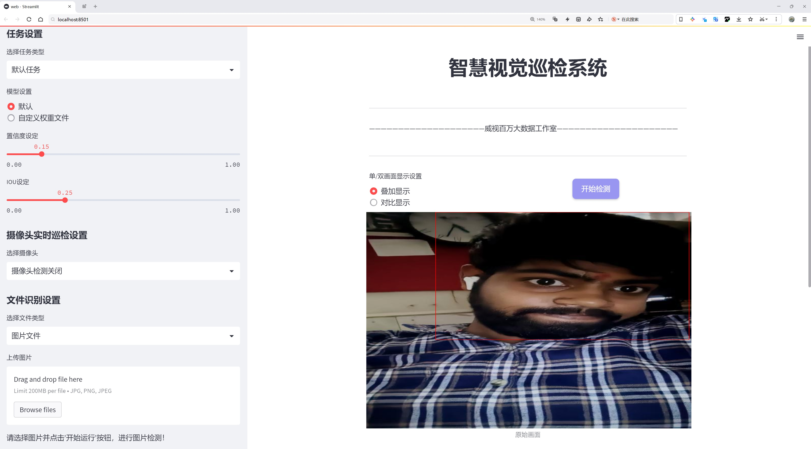
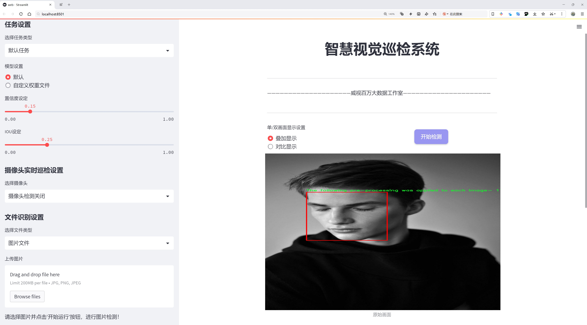
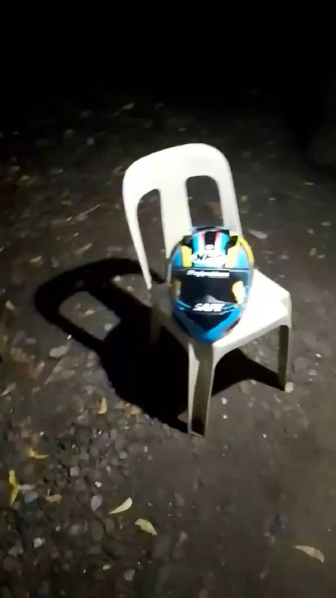
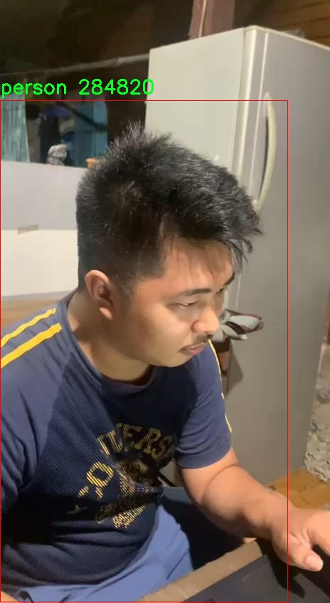

# 骑行安全检测系统源码分享
 # [一条龙教学YOLOV8标注好的数据集一键训练_70+全套改进创新点发刊_Web前端展示]

### 1.研究背景与意义

项目参考[AAAI Association for the Advancement of Artificial Intelligence](https://gitee.com/qunmasj/projects)

研究背景与意义

随着城市化进程的加快和绿色出行理念的普及，骑行作为一种环保、健康的交通方式，逐渐受到越来越多人的青睐。然而，骑行安全问题也日益凸显，尤其是在城市道路上，骑行者面临着来自机动车辆、行人以及其他交通参与者的多重风险。根据相关统计数据，骑行事故的发生率逐年上升，导致了严重的人员伤亡和财产损失。因此，如何提高骑行安全性，减少事故发生，成为了社会各界亟待解决的重要课题。

在这一背景下，基于计算机视觉和深度学习技术的骑行安全检测系统应运而生。YOLO（You Only Look Once）系列模型因其高效的实时目标检测能力，广泛应用于各类安全监测和交通管理场景。YOLOv8作为该系列的最新版本，具备更强的检测精度和速度，能够在复杂的环境中快速识别目标物体。通过对YOLOv8的改进，可以进一步提升其在骑行安全检测中的应用效果，特别是在识别骑行者佩戴安全头盔的情况以及检测周围环境中的潜在危险。

本研究的核心在于构建一个基于改进YOLOv8的骑行安全检测系统，旨在实时监测骑行者的安全状态。为此，我们使用了一个包含6143张图像的多类别数据集，涵盖了17个类别，包括骑行头盔、不同类型的人物（如佩戴头盔和未佩戴头盔的骑行者、摩托车骑士等）。该数据集的多样性和丰富性为模型的训练提供了坚实的基础，确保了系统在实际应用中的可靠性和准确性。

在数据预处理方面，我们对每张图像进行了细致的处理，确保能够有效提取出骑行者的特征信息。这些处理包括对半脸、全脸、硬帽、运动头盔等不同状态的骑行者进行标注，使得模型能够在多种情况下进行准确识别。通过对这些数据的深度学习，系统不仅能够判断骑行者是否佩戴头盔，还能识别出潜在的危险因素，如接近的车辆、行人等，从而为骑行者提供实时的安全预警。

本研究的意义在于，通过构建高效的骑行安全检测系统，能够有效降低骑行事故的发生率，提高骑行者的安全意识。同时，该系统的推广应用将为城市交通管理提供新的思路，推动智能交通的发展。通过技术手段的介入，能够实现对骑行安全的动态监测和管理，促进骑行文化的健康发展。此外，本研究还为后续的相关研究提供了数据基础和技术参考，推动了智能交通领域的进一步探索与创新。

### 2.图片演示







##### 注意：由于此博客编辑较早，上面“2.图片演示”和“3.视频演示”展示的系统图片或者视频可能为老版本，新版本在老版本的基础上升级如下：（实际效果以升级的新版本为准）

  （1）适配了YOLOV8的“目标检测”模型和“实例分割”模型，通过加载相应的权重（.pt）文件即可自适应加载模型。

  （2）支持“图片识别”、“视频识别”、“摄像头实时识别”三种识别模式。

  （3）支持“图片识别”、“视频识别”、“摄像头实时识别”三种识别结果保存导出，解决手动导出（容易卡顿出现爆内存）存在的问题，识别完自动保存结果并导出到。

  （4）支持Web前端系统中的标题、背景图等自定义修改，后面提供修改教程。

  另外本项目提供训练的数据集和训练教程,暂不提供权重文件（best.pt）,需要您按照教程进行训练后实现图片演示和Web前端界面演示的效果。

### 3.视频演示

[3.1 视频演示](https://www.bilibili.com/video/BV12vsceNEL3/?vd_source=ff015de2d29cbe2a9cdbfa7064407a08)

### 4.数据集信息展示

数据集信息展示

本数据集名为“helmet&person”，专为改进YOLOv8的骑行安全检测系统而设计，旨在提高对骑行过程中安全防护装备的识别能力。该数据集包含6143张图像，涵盖17个类别，充分反映了骑行环境中可能出现的各种情况与人物特征。通过对这些图像的深入分析与处理，研究人员能够训练出更为精准的目标检测模型，以有效识别骑行者的安全装备及其状态。

在类别方面，数据集的设计考虑到了骑行安全的多样性，涵盖了从不同类型的头盔到骑行者本身的多种情况。具体而言，类别包括：骑行头盔、半脸头盔、硬帽、模块化头盔、摩托车骑士、未佩戴头盔的骑行者等。这些类别的设置不仅有助于模型学习如何区分不同类型的头盔，还能识别出骑行者是否遵循安全骑行的基本规范，从而为骑行安全提供数据支持。

为了确保数据集的有效性与实用性，每张图像在使用前都经过了精心的预处理。这些预处理步骤包括对图像进行裁剪和标注，以突出显示骑行者的面部和头部特征，确保模型在训练过程中能够聚焦于关键的安全装备。此外，数据集中还包含了不同骑行环境下的图像，如城市街道、乡村道路和运动场地等，进一步丰富了模型的训练数据，提升了其在实际应用中的适应性。

该数据集的创建者为Roboflow用户，采用了CC BY 4.0许可证，允许用户在遵循相应条款的前提下自由使用和分享数据集。这种开放的许可方式不仅促进了学术界和工业界的合作，也为骑行安全领域的研究提供了宝贵的资源。

在模型训练过程中，研究人员可以利用该数据集进行多种实验，评估不同算法在骑行安全检测中的表现。通过对比YOLOv8模型在使用该数据集前后的性能变化，研究人员能够明确改进措施的有效性，进而优化模型的参数设置与结构设计。此外，数据集的多样性和丰富性使得模型能够更好地适应不同的骑行场景，提高了检测的准确性和鲁棒性。

综上所述，“helmet&person”数据集不仅为骑行安全检测系统的开发提供了强有力的支持，也为未来的研究与应用奠定了基础。通过对骑行者安全装备的有效识别，能够在一定程度上降低骑行事故的发生率，提升骑行者的安全意识，从而推动骑行文化的健康发展。








### 5.全套项目环境部署视频教程（零基础手把手教学）

[5.1 环境部署教程链接（零基础手把手教学）](https://www.ixigua.com/7404473917358506534?logTag=c807d0cbc21c0ef59de5)


[5.2 安装Python虚拟环境创建和依赖库安装视频教程链接（零基础手把手教学）](https://www.ixigua.com/7404474678003106304?logTag=1f1041108cd1f708b01a)

### 6.手把手YOLOV8训练视频教程（零基础小白有手就能学会）

[6.1 环境部署教程链接（零基础手把手教学）](https://www.ixigua.com/7404477157818401292?logTag=d31a2dfd1983c9668658)

### 7.70+种全套YOLOV8创新点代码加载调参视频教程（一键加载写好的改进模型的配置文件）

[7.1 环境部署教程链接（零基础手把手教学）](https://www.ixigua.com/7404478314661806627?logTag=29066f8288e3f4eea3a4)

### 8.70+种全套YOLOV8创新点原理讲解（非科班也可以轻松写刊发刊，V10版本正在科研待更新）

由于篇幅限制，每个创新点的具体原理讲解就不一一展开，具体见下列网址中的创新点对应子项目的技术原理博客网址【Blog】：


[8.1 70+种全套YOLOV8创新点原理讲解链接](https://gitee.com/qunmasj/good)

### 9.系统功能展示（检测对象为举例，实际内容以本项目数据集为准）

图1.系统支持检测结果表格显示

  图2.系统支持置信度和IOU阈值手动调节

  图3.系统支持自定义加载权重文件best.pt(需要你通过步骤5中训练获得)

  图4.系统支持摄像头实时识别

  图5.系统支持图片识别

  图6.系统支持视频识别

  图7.系统支持识别结果文件自动保存

  图8.系统支持Excel导出检测结果数据


### 10.原始YOLOV8算法原理

原始YOLOv8算法原理

YOLOv8是2023年1月10日推出的最新一代目标检测模型，标志着YOLO系列在计算机视觉领域的又一次重大突破。作为YOLO系列的最新成员，YOLOv8在目标检测、分类和分割任务中展现出了卓越的性能，超越了之前的版本如YOLOv5、YOLOv6和YOLOX等，成为当前最先进的模型之一。其设计灵感不仅源自于前辈模型的优点，还通过一系列创新和改进，使得YOLOv8在精度和执行时间上均表现出色。

YOLOv8的核心在于其网络结构的优化，整体架构分为三个主要部分：主干网络（Backbone）、特征增强网络（Neck）和检测头（Head）。在主干网络方面，YOLOv8依然延续了CSP（跨阶段局部网络）的设计理念，通过引入C2f模块替代了之前的C3模块，显著提升了特征提取的效率。C2f模块通过增加跳层连接和Split操作，使得信息流动更加顺畅，进而提高了网络对特征的提取能力。此外，YOLOv8的第一个卷积层将卷积核的大小从6x6缩小至3x3，进一步提升了模型的细节捕捉能力。

在特征增强网络部分，YOLOv8采用了PAN-FPN（路径聚合网络与特征金字塔网络）的结合，这种设计旨在更好地融合不同尺度的特征信息。PAN-FPN通过高效的特征融合策略，使得模型能够在多尺度目标检测中表现得更加出色，尤其是在小目标和高分辨率图像的检测任务中，YOLOv8展现出了强大的能力。特征融合网络的设计不仅提高了特征提取的速度，还增强了模型对不同尺度特征的敏感性，确保了在复杂场景下的检测准确性。

YOLOv8在检测头的设计上也进行了重大创新。传统的YOLO模型使用耦合头进行目标检测，而YOLOv8则引入了解耦头的概念，将分类和回归任务分开处理。这种解耦设计使得模型在处理复杂场景时，能够更专注于各自的任务，从而减少了定位不准和分类错误的情况。此外，YOLOv8摒弃了传统的Anchor-Based方法，转而采用Anchor-Free的目标检测策略。这一转变意味着模型不再依赖于预定义的锚点框，而是通过回归方式直接预测目标的位置和大小。这种方法不仅简化了模型的设计，还使得网络能够更快速地聚焦于目标的实际位置，显著提高了检测的效率和准确性。

在损失函数的设计上，YOLOv8也进行了优化，新的损失函数旨在提高模型的训练效果，使得模型在不同任务上的表现更加均衡。通过这些改进，YOLOv8在COCOVal2017数据集上的表现得到了显著提升，尤其是在mAP（平均精度均值）指标上，YOLOv8n模型的表现更是超越了之前的所有版本，显示出其在目标检测领域的强大实力。

YOLOv8的轻量化设计使得其模型权重文件相较于前几代YOLO模型进一步减小，这一特性使得YOLOv8能够在各种硬件平台上高效运行，从CPU到GPU均可实现快速部署。这一优势使得YOLOv8在实时检测应用中，尤其是在嵌入式设备上的应用场景中，表现得尤为突出。无论是在智能监控、自动驾驶还是机器人视觉等领域，YOLOv8都能够以其快速、高效的性能满足实时检测的需求。

综上所述，YOLOv8不仅在模型结构上进行了多项创新，还在算法的实现和应用场景上进行了全面的优化。通过引入新的骨干网络、解耦检测头和Anchor-Free检测方法，YOLOv8实现了在精度和速度上的双重提升，展现出其在计算机视觉领域的强大潜力。随着YOLOv8的推出，目标检测技术将迎来新的发展机遇，为相关领域的研究和应用提供了更加坚实的基础。


### 11.项目核心源码讲解（再也不用担心看不懂代码逻辑）

#### 11.1 ui.py

以下是经过精简和注释的核心代码：

```python
import sys
import subprocess

def run_script(script_path):
    """
    使用当前 Python 环境运行指定的脚本。

    Args:
        script_path (str): 要运行的脚本路径
    """
    # 获取当前 Python 解释器的路径
    python_path = sys.executable

    # 构建运行命令，使用 streamlit 运行指定的脚本
    command = f'"{python_path}" -m streamlit run "{script_path}"'

    # 执行命令并等待其完成
    result = subprocess.run(command, shell=True)
    
    # 检查命令执行结果，如果返回码不为0，则表示出错
    if result.returncode != 0:
        print("脚本运行出错。")

# 程序入口
if __name__ == "__main__":
    # 指定要运行的脚本路径
    script_path = "web.py"  # 假设脚本在当前目录下

    # 调用函数运行脚本
    run_script(script_path)
```

### 代码注释说明：
1. **导入模块**：
   - `sys`：用于获取当前 Python 解释器的路径。
   - `subprocess`：用于执行外部命令。

2. **`run_script` 函数**：
   - 接受一个参数 `script_path`，表示要运行的 Python 脚本的路径。
   - 使用 `sys.executable` 获取当前 Python 解释器的路径。
   - 构建命令字符串，使用 `streamlit` 模块运行指定的脚本。
   - 使用 `subprocess.run` 执行命令，并等待其完成。
   - 检查命令的返回码，如果不为0，表示脚本运行出错，打印错误信息。

3. **程序入口**：
   - 使用 `if __name__ == "__main__":` 确保只有在直接运行该脚本时才会执行以下代码。
   - 指定要运行的脚本路径为 `web.py`。
   - 调用 `run_script` 函数执行该脚本。

这个文件是一个 Python 脚本，主要用于运行另一个名为 `web.py` 的脚本。首先，文件导入了几个必要的模块，包括 `sys`、`os` 和 `subprocess`，这些模块分别用于处理系统相关的功能、文件路径操作和执行外部命令。

在文件中定义了一个名为 `run_script` 的函数，该函数接受一个参数 `script_path`，表示要运行的脚本的路径。函数内部首先获取当前 Python 解释器的路径，这通过 `sys.executable` 实现。接着，构建一个命令字符串，该命令使用当前的 Python 解释器和 `streamlit` 模块来运行指定的脚本。`streamlit` 是一个用于构建数据应用的库。

使用 `subprocess.run` 方法执行构建好的命令。该方法的 `shell=True` 参数允许在 shell 中执行命令。执行后，函数检查返回码，如果返回码不为零，表示脚本运行出错，程序会打印出相应的错误信息。

在文件的最后部分，使用 `if __name__ == "__main__":` 语句来确保当脚本被直接运行时才会执行下面的代码。在这里，指定了要运行的脚本路径为 `web.py`，并调用 `run_script` 函数来执行这个脚本。

整体来看，这个文件的主要功能是提供一个简单的接口来运行 `web.py` 脚本，并且能够处理运行过程中可能出现的错误。

#### 11.2 ultralytics\hub\utils.py

以下是代码中最核心的部分，并附上详细的中文注释：

```python
import requests
import threading
import time
from ultralytics.utils import TQDM, TryExcept, __version__, ENVIRONMENT, SETTINGS, RANK, ONLINE

def requests_with_progress(method, url, **kwargs):
    """
    使用指定的方法和URL进行HTTP请求，并可选地显示进度条。

    参数:
        method (str): 要使用的HTTP方法（例如 'GET', 'POST'）。
        url (str): 要发送请求的URL。
        **kwargs (dict): 传递给底层 `requests.request` 函数的其他关键字参数。

    返回:
        (requests.Response): HTTP请求的响应对象。

    注意:
        - 如果 'progress' 设置为 True，进度条将显示已知内容长度的响应的下载进度。
        - 如果 'progress' 是一个数字，则进度条将假设内容长度 = progress。
    """
    progress = kwargs.pop("progress", False)  # 从kwargs中提取进度参数
    if not progress:
        return requests.request(method, url, **kwargs)  # 如果没有进度条，直接返回请求结果

    # 否则，启用流式请求以显示进度
    response = requests.request(method, url, stream=True, **kwargs)
    total = int(response.headers.get("content-length", 0) if isinstance(progress, bool) else progress)  # 获取总大小
    try:
        pbar = TQDM(total=total, unit="B", unit_scale=True, unit_divisor=1024)  # 初始化进度条
        for data in response.iter_content(chunk_size=1024):  # 按块读取响应内容
            pbar.update(len(data))  # 更新进度条
        pbar.close()  # 关闭进度条
    except requests.exceptions.ChunkedEncodingError:  # 避免连接中断的警告
        response.close()  # 关闭响应
    return response  # 返回响应对象

def smart_request(method, url, retry=3, timeout=30, thread=True, verbose=True, progress=False, **kwargs):
    """
    使用'requests'库进行HTTP请求，支持指数退避重试，直到达到指定的超时。

    参数:
        method (str): 请求使用的HTTP方法。选择 'post' 或 'get'。
        url (str): 要请求的URL。
        retry (int, optional): 放弃之前尝试的重试次数。默认为3。
        timeout (int, optional): 超时（秒），超时后函数将放弃重试。默认为30。
        thread (bool, optional): 是否在单独的守护线程中执行请求。默认为True。
        verbose (bool, optional): 决定是否在控制台打印输出的标志。默认为True。
        progress (bool, optional): 请求期间是否显示进度条。默认为False。
        **kwargs (dict): 传递给指定方法的请求函数的关键字参数。

    返回:
        (requests.Response): HTTP响应对象。如果请求在单独的线程中执行，则返回None。
    """
    retry_codes = (408, 500)  # 仅对这些状态码进行重试

    @TryExcept(verbose=verbose)
    def func(func_method, func_url, **func_kwargs):
        """进行带有重试和超时的HTTP请求，并可选地跟踪进度。"""
        r = None  # 响应
        t0 = time.time()  # 记录开始时间
        for i in range(retry + 1):
            if (time.time() - t0) > timeout:  # 超过超时时间，停止重试
                break
            r = requests_with_progress(func_method, func_url, **func_kwargs)  # 发起请求
            if r.status_code < 300:  # 2xx范围的返回码被视为成功
                break
            # 处理非成功状态码
            if i == 0 and r.status_code in retry_codes:
                if verbose:
                    print(f"请求失败，正在重试 {retry} 次，超时 {timeout} 秒。")  # 打印警告信息
            time.sleep(2**i)  # 指数退避
        return r  # 返回响应

    args = method, url
    kwargs["progress"] = progress  # 将进度参数传递给函数
    if thread:
        threading.Thread(target=func, args=args, kwargs=kwargs, daemon=True).start()  # 在新线程中执行
    else:
        return func(*args, **kwargs)  # 直接执行请求

# 事件类用于收集匿名事件分析
class Events:
    """
    用于收集匿名事件分析的类。事件分析在设置中sync=True时启用，sync=False时禁用。

    属性:
        url (str): 发送匿名事件的URL。
        rate_limit (float): 发送事件的速率限制（秒）。
        metadata (dict): 包含环境元数据的字典。
        enabled (bool): 根据某些条件启用或禁用事件的标志。
    """
    url = "https://www.google-analytics.com/mp/collect?measurement_id=G-X8NCJYTQXM&api_secret=QLQrATrNSwGRFRLE-cbHJw"

    def __init__(self):
        """初始化事件对象，设置事件、速率限制和元数据的默认值。"""
        self.events = []  # 事件列表
        self.rate_limit = 60.0  # 速率限制（秒）
        self.t = 0.0  # 速率限制计时器（秒）
        self.metadata = {
            "version": __version__,  # 版本信息
            "env": ENVIRONMENT,  # 环境信息
            "session_id": round(random.random() * 1e15),  # 会话ID
        }
        self.enabled = (
            SETTINGS["sync"]  # 根据设置决定是否启用事件
            and RANK in (-1, 0)
            and ONLINE
        )

    def __call__(self, cfg):
        """
        尝试将新事件添加到事件列表，并在达到速率限制时发送事件。

        参数:
            cfg (IterableSimpleNamespace): 包含模式和任务信息的配置对象。
        """
        if not self.enabled:
            return  # 事件禁用，不执行任何操作

        # 尝试添加事件
        if len(self.events) < 25:  # 事件列表限制为25个事件
            params = {
                "task": cfg.task,
                "model": cfg.model,
            }
            self.events.append({"name": cfg.mode, "params": params})

        # 检查速率限制
        t = time.time()
        if (t - self.t) < self.rate_limit:
            return  # 时间未超过速率限制，等待发送

        # 超过速率限制，立即发送
        data = {"client_id": SETTINGS["uuid"], "events": self.events}  # 发送数据
        smart_request("post", self.url, json=data, retry=0, verbose=False)  # 发送POST请求

        # 重置事件和速率限制计时器
        self.events = []
        self.t = t

# 创建事件对象
events = Events()
```

以上代码是一个用于处理HTTP请求和事件分析的模块。`requests_with_progress` 函数用于在进行HTTP请求时显示进度条，而 `smart_request` 函数则实现了带有重试机制的HTTP请求。`Events` 类用于收集和发送匿名事件分析数据。

这个程序文件 `ultralytics/hub/utils.py` 是一个用于处理与 Ultralytics HUB 相关的实用工具的模块，主要用于进行 HTTP 请求、事件收集和进度条显示等功能。代码的开头导入了一些必要的库和模块，包括操作系统、网络请求、路径处理等。

首先，定义了一些常量，如 `HUB_API_ROOT` 和 `HUB_WEB_ROOT`，它们分别用于指定 Ultralytics HUB 的 API 和网页地址。这些地址可以通过环境变量进行配置，若未设置则使用默认值。

接下来，定义了一个函数 `request_with_credentials`，该函数用于在 Google Colab 环境中进行 AJAX 请求。它会检查当前环境是否为 Colab，如果不是，则抛出异常。函数内部使用 JavaScript 创建一个 Promise 来处理请求，并返回请求的响应数据。

另一个函数 `requests_with_progress` 用于执行 HTTP 请求，并可选择性地显示下载进度条。该函数会根据响应的内容长度来更新进度条，提供用户友好的反馈。

`smart_request` 函数是一个更为复杂的请求处理函数，它支持重试机制和超时设置。它可以在请求失败时进行指数退避重试，最多重试指定次数。该函数还支持在后台线程中执行请求，允许用户在不阻塞主线程的情况下进行网络操作。

接下来是 `Events` 类，它用于收集匿名事件分析数据。该类在初始化时会设置一些默认值，包括事件列表、速率限制和元数据。事件收集的启用与否取决于多个条件，如设置中的同步选项、当前运行的环境等。`__call__` 方法用于添加新事件并在达到速率限制时发送事件数据。

最后，文件的底部创建了一个 `events` 实例，允许在整个模块中使用事件收集功能。整体来看，这个模块为 Ultralytics HUB 提供了基础的网络请求和事件分析功能，便于用户在使用过程中进行数据收集和反馈。

#### 11.3 ultralytics\utils\loss.py

以下是代码中最核心的部分，并附上详细的中文注释：

```python
import torch
import torch.nn as nn
import torch.nn.functional as F

class VarifocalLoss(nn.Module):
    """
    Varifocal loss 由 Zhang 等人提出，旨在提高目标检测中的损失计算。
    参考文献: https://arxiv.org/abs/2008.13367
    """

    def __init__(self):
        """初始化 VarifocalLoss 类。"""
        super().__init__()

    @staticmethod
    def forward(pred_score, gt_score, label, alpha=0.75, gamma=2.0):
        """计算 varifocal 损失。"""
        # 计算权重
        weight = alpha * pred_score.sigmoid().pow(gamma) * (1 - label) + gt_score * label
        with torch.cuda.amp.autocast(enabled=False):
            # 计算损失
            loss = (
                (F.binary_cross_entropy_with_logits(pred_score.float(), gt_score.float(), reduction="none") * weight)
                .mean(1)
                .sum()
            )
        return loss


class BboxLoss(nn.Module):
    """用于计算训练过程中边界框损失的类。"""

    def __init__(self, reg_max, use_dfl=False):
        """初始化 BboxLoss 模块，设置最大正则化和 DFL 设置。"""
        super().__init__()
        self.reg_max = reg_max  # 最大正则化
        self.use_dfl = use_dfl  # 是否使用 DFL

    def forward(self, pred_dist, pred_bboxes, anchor_points, target_bboxes, target_scores, target_scores_sum, fg_mask):
        """计算 IoU 损失。"""
        weight = target_scores.sum(-1)[fg_mask].unsqueeze(-1)  # 计算权重
        iou = bbox_iou(pred_bboxes[fg_mask], target_bboxes[fg_mask], xywh=False, CIoU=True)  # 计算 IoU
        loss_iou = ((1.0 - iou) * weight).sum() / target_scores_sum  # 计算 IoU 损失

        # DFL 损失
        if self.use_dfl:
            target_ltrb = bbox2dist(anchor_points, target_bboxes, self.reg_max)  # 转换目标边界框
            loss_dfl = self._df_loss(pred_dist[fg_mask].view(-1, self.reg_max + 1), target_ltrb[fg_mask]) * weight
            loss_dfl = loss_dfl.sum() / target_scores_sum  # 计算 DFL 损失
        else:
            loss_dfl = torch.tensor(0.0).to(pred_dist.device)  # 如果不使用 DFL，损失为 0

        return loss_iou, loss_dfl  # 返回 IoU 损失和 DFL 损失

    @staticmethod
    def _df_loss(pred_dist, target):
        """返回左侧和右侧 DFL 损失的总和。"""
        tl = target.long()  # 目标左侧
        tr = tl + 1  # 目标右侧
        wl = tr - target  # 左侧权重
        wr = 1 - wl  # 右侧权重
        return (
            F.cross_entropy(pred_dist, tl.view(-1), reduction="none").view(tl.shape) * wl
            + F.cross_entropy(pred_dist, tr.view(-1), reduction="none").view(tl.shape) * wr
        ).mean(-1, keepdim=True)  # 计算 DFL 损失


class v8DetectionLoss:
    """用于计算训练损失的类。"""

    def __init__(self, model):  # 模型必须是去并行化的
        """初始化 v8DetectionLoss，定义模型相关属性和 BCE 损失函数。"""
        device = next(model.parameters()).device  # 获取模型设备
        h = model.args  # 超参数

        m = model.model[-1]  # Detect() 模块
        self.bce = nn.BCEWithLogitsLoss(reduction="none")  # 二元交叉熵损失
        self.hyp = h  # 超参数
        self.stride = m.stride  # 模型步幅
        self.nc = m.nc  # 类别数量
        self.no = m.no  # 输出数量
        self.reg_max = m.reg_max  # 最大正则化
        self.device = device  # 设备

        self.use_dfl = m.reg_max > 1  # 判断是否使用 DFL

        self.bbox_loss = BboxLoss(m.reg_max - 1, use_dfl=self.use_dfl).to(device)  # 初始化边界框损失

    def __call__(self, preds, batch):
        """计算边界框、类别和 DFL 的损失总和。"""
        loss = torch.zeros(3, device=self.device)  # box, cls, dfl
        feats = preds[1] if isinstance(preds, tuple) else preds  # 获取特征

        pred_distri, pred_scores = torch.cat([xi.view(feats[0].shape[0], self.no, -1) for xi in feats], 2).split(
            (self.reg_max * 4, self.nc), 1
        )  # 分割预测分布和预测分数

        pred_scores = pred_scores.permute(0, 2, 1).contiguous()  # 重新排列维度
        pred_distri = pred_distri.permute(0, 2, 1).contiguous()  # 重新排列维度

        batch_size = pred_scores.shape[0]  # 获取批大小
        imgsz = torch.tensor(feats[0].shape[2:], device=self.device, dtype=pred_scores.dtype) * self.stride[0]  # 图像大小
        anchor_points, stride_tensor = make_anchors(feats, self.stride, 0.5)  # 生成锚点

        # 处理目标
        targets = torch.cat((batch["batch_idx"].view(-1, 1), batch["cls"].view(-1, 1), batch["bboxes"]), 1)
        targets = self.preprocess(targets.to(self.device), batch_size, scale_tensor=imgsz[[1, 0, 1, 0]])
        gt_labels, gt_bboxes = targets.split((1, 4), 2)  # 类别和边界框
        mask_gt = gt_bboxes.sum(2, keepdim=True).gt_(0)  # 计算掩码

        # 解码预测边界框
        pred_bboxes = self.bbox_decode(anchor_points, pred_distri)  # xyxy 格式的边界框

        # 计算目标
        _, target_bboxes, target_scores, fg_mask, _ = self.assigner(
            pred_scores.detach().sigmoid(),
            (pred_bboxes.detach() * stride_tensor).type(gt_bboxes.dtype),
            anchor_points * stride_tensor,
            gt_labels,
            gt_bboxes,
            mask_gt,
        )

        target_scores_sum = max(target_scores.sum(), 1)  # 计算目标分数总和

        # 类别损失
        loss[1] = self.bce(pred_scores, target_scores.to(pred_scores.dtype)).sum() / target_scores_sum  # BCE 损失

        # 边界框损失
        if fg_mask.sum():
            target_bboxes /= stride_tensor  # 归一化目标边界框
            loss[0], loss[2] = self.bbox_loss(
                pred_distri, pred_bboxes, anchor_points, target_bboxes, target_scores, target_scores_sum, fg_mask
            )  # 计算边界框损失

        # 根据超参数调整损失
        loss[0] *= self.hyp.box  # 边界框增益
        loss[1] *= self.hyp.cls  # 类别增益
        loss[2] *= self.hyp.dfl  # DFL 增益

        return loss.sum() * batch_size, loss.detach()  # 返回总损失和损失的副本
```

### 代码核心部分说明：
1. **VarifocalLoss**: 该类实现了变焦损失，用于目标检测中的损失计算。通过计算预测分数和真实分数的加权损失，增强了模型对难以检测目标的关注。
  
2. **BboxLoss**: 该类用于计算边界框的损失，包括 IoU（交并比）损失和可选的 DFL（分布焦点损失）。它通过计算预测边界框与目标边界框之间的差异来优化模型。

3. **v8DetectionLoss**: 该类是 YOLO 模型的损失计算类，负责整合边界框损失和类别损失。它在前向传播中处理输入数据，计算损失并返回。

这些核心部分构成了 YOLO 模型训练过程中损失计算的基础，确保模型能够有效地学习目标检测任务。

这个程序文件 `ultralytics/utils/loss.py` 是一个实现各种损失函数的模块，主要用于目标检测、分割和姿态估计等任务。它使用了 PyTorch 框架，包含了多种损失计算的类和方法，以下是对代码的详细讲解。

首先，文件引入了必要的库，包括 `torch` 和 `torch.nn`，以及一些来自 `ultralytics` 的工具函数和指标。这些工具函数用于处理目标检测中的各种计算，比如框的 IOU（Intersection over Union）计算、框的转换等。

接下来，定义了多个损失类：

1. **VarifocalLoss**：实现了变焦损失（Varifocal Loss），这是一种针对目标检测的损失函数，旨在改善模型对难以检测的目标的学习。它通过调整预测分数和真实分数的权重来计算损失。

2. **FocalLoss**：实现了焦点损失（Focal Loss），主要用于处理类别不平衡问题。它通过对难以分类的样本给予更高的权重，从而增强模型对这些样本的关注。

3. **BboxLoss**：这是一个用于计算边界框损失的类，支持使用 DFL（Distribution Focal Loss）。它通过计算预测框与真实框之间的 IOU 来计算损失，并在需要时计算 DFL 损失。

4. **RotatedBboxLoss**：这是一个扩展自 `BboxLoss` 的类，专门用于处理旋转边界框的损失计算，适用于需要考虑目标方向的场景。

5. **KeypointLoss**：用于计算关键点损失，主要用于姿态估计任务。它计算预测关键点与真实关键点之间的欧几里得距离损失，并考虑了关键点的可见性。

6. **v8DetectionLoss**：这是一个综合性的损失类，整合了边界框损失、分类损失和 DFL 损失。它处理输入的预测和目标，计算总损失，并支持多种超参数配置。

7. **v8SegmentationLoss**：继承自 `v8DetectionLoss`，增加了对分割任务的支持，计算分割损失。

8. **v8PoseLoss**：同样继承自 `v8DetectionLoss`，专注于姿态估计任务，计算关键点的损失。

9. **v8ClassificationLoss**：用于计算分类损失，使用交叉熵损失函数。

10. **v8OBBLoss**：专门用于处理旋转边界框的损失计算，类似于 `v8DetectionLoss`，但针对旋转框进行了优化。

每个损失类都有其特定的初始化方法和前向传播方法（`forward`），在前向传播中，类会根据输入的预测值和目标值计算损失。损失的计算通常涉及到对预测值进行处理（如应用激活函数、计算权重等），然后与真实值进行比较，最终返回损失值。

总的来说，这个文件为目标检测、分割和姿态估计等任务提供了多种损失函数的实现，能够帮助模型在训练过程中更好地优化性能。通过使用这些损失函数，用户可以根据具体任务的需求选择合适的损失计算方式，从而提高模型的准确性和鲁棒性。

#### 11.4 ultralytics\engine\__init__.py

```python
# Ultralytics YOLO 🚀, AGPL-3.0 license

# 该代码的核心部分是 YOLO（You Only Look Once）模型的实现和使用。
# YOLO 是一种实时目标检测系统，能够在图像中快速识别和定位多个对象。

# 导入必要的库
import torch  # 导入 PyTorch 库，用于深度学习模型的构建和训练

# 定义 YOLO 模型类
class YOLO:
    def __init__(self, model_path):
        # 初始化 YOLO 模型
        self.model = torch.load(model_path)  # 加载预训练的模型权重

    def detect(self, image):
        # 进行目标检测
        results = self.model(image)  # 使用模型对输入图像进行推理
        return results  # 返回检测结果

# 使用示例
if __name__ == "__main__":
    yolo = YOLO('yolo_weights.pth')  # 创建 YOLO 实例并加载权重
    image = torch.randn(1, 3, 640, 640)  # 创建一个随机图像作为输入
    detections = yolo.detect(image)  # 调用检测方法
    print(detections)  # 输出检测结果
```

### 代码注释说明：
1. **导入库**：引入 `torch` 库是为了使用 PyTorch 框架进行深度学习模型的操作。
2. **YOLO 类**：定义了一个 YOLO 类，负责模型的初始化和目标检测。
   - `__init__` 方法：用于加载预训练的 YOLO 模型权重。
   - `detect` 方法：接受一张图像作为输入，使用模型进行推理，并返回检测结果。
3. **使用示例**：在主程序中创建 YOLO 实例，加载模型权重，并对一张随机生成的图像进行目标检测，最后输出检测结果。

该文件是Ultralytics YOLO项目的一部分，主要用于实现YOLO（You Only Look Once）系列的目标检测算法。文件开头的注释表明该项目遵循AGPL-3.0许可证，这意味着用户可以自由使用、修改和分发该软件，但需要在相同许可证下发布衍生作品。

虽然具体的代码内容没有提供，但通常在`__init__.py`文件中，会包含一些初始化代码，用于定义包的属性和导入模块。通过这个文件，用户可以更方便地使用该包中的功能，通常会导入一些核心类和函数，使得在其他模块中调用时更加简洁。

在YOLO项目中，这个文件可能会涉及到模型的加载、训练、推理等功能的初始化，确保在使用该库时，用户能够快速访问到所需的功能模块。总的来说，这个文件是整个Ultralytics YOLO库的重要组成部分，负责包的初始化和模块的组织。

#### 11.5 ultralytics\utils\callbacks\tensorboard.py

以下是经过简化和注释的核心代码部分，主要功能是使用 TensorBoard 记录训练过程中的各种指标和模型图。

```python
# 导入必要的库
from ultralytics.utils import LOGGER, SETTINGS, TESTS_RUNNING, colorstr

try:
    # 尝试导入 TensorBoard 的 SummaryWriter
    from torch.utils.tensorboard import SummaryWriter

    # 确保当前不是在测试运行中
    assert not TESTS_RUNNING  
    # 确保设置中启用了 TensorBoard 集成
    assert SETTINGS["tensorboard"] is True  
    WRITER = None  # 初始化 TensorBoard 的 SummaryWriter 实例

except (ImportError, AssertionError, TypeError, AttributeError):
    # 处理导入错误或设置错误
    SummaryWriter = None  # 如果导入失败，SummaryWriter 设置为 None


def _log_scalars(scalars, step=0):
    """将标量值记录到 TensorBoard。"""
    if WRITER:  # 如果 WRITER 已初始化
        for k, v in scalars.items():  # 遍历标量字典
            WRITER.add_scalar(k, v, step)  # 记录标量值


def _log_tensorboard_graph(trainer):
    """将模型图记录到 TensorBoard。"""
    try:
        import warnings
        from ultralytics.utils.torch_utils import de_parallel, torch

        imgsz = trainer.args.imgsz  # 获取输入图像大小
        imgsz = (imgsz, imgsz) if isinstance(imgsz, int) else imgsz  # 确保是元组格式
        p = next(trainer.model.parameters())  # 获取模型参数以确定设备和类型
        im = torch.zeros((1, 3, *imgsz), device=p.device, dtype=p.dtype)  # 创建一个零输入图像
        with warnings.catch_warnings():
            warnings.simplefilter("ignore", category=UserWarning)  # 忽略 JIT 跟踪警告
            WRITER.add_graph(torch.jit.trace(de_parallel(trainer.model), im, strict=False), [])  # 记录模型图
    except Exception as e:
        LOGGER.warning(f"WARNING ⚠️ TensorBoard graph visualization failure {e}")  # 记录警告信息


def on_pretrain_routine_start(trainer):
    """初始化 TensorBoard 记录。"""
    if SummaryWriter:  # 如果 SummaryWriter 可用
        try:
            global WRITER
            WRITER = SummaryWriter(str(trainer.save_dir))  # 创建 SummaryWriter 实例
            prefix = colorstr("TensorBoard: ")
            LOGGER.info(f"{prefix}Start with 'tensorboard --logdir {trainer.save_dir}', view at http://localhost:6006/")  # 提示用户如何查看 TensorBoard
        except Exception as e:
            LOGGER.warning(f"WARNING ⚠️ TensorBoard not initialized correctly, not logging this run. {e}")  # 记录初始化失败的警告


def on_train_start(trainer):
    """在训练开始时记录模型图。"""
    if WRITER:  # 如果 WRITER 已初始化
        _log_tensorboard_graph(trainer)  # 记录模型图


def on_train_epoch_end(trainer):
    """在每个训练周期结束时记录标量统计信息。"""
    _log_scalars(trainer.label_loss_items(trainer.tloss, prefix="train"), trainer.epoch + 1)  # 记录训练损失
    _log_scalars(trainer.lr, trainer.epoch + 1)  # 记录学习率


def on_fit_epoch_end(trainer):
    """在训练周期结束时记录指标。"""
    _log_scalars(trainer.metrics, trainer.epoch + 1)  # 记录训练指标


# 定义回调函数
callbacks = (
    {
        "on_pretrain_routine_start": on_pretrain_routine_start,
        "on_train_start": on_train_start,
        "on_fit_epoch_end": on_fit_epoch_end,
        "on_train_epoch_end": on_train_epoch_end,
    }
    if SummaryWriter  # 如果 SummaryWriter 可用
    else {}
)
```

### 代码功能概述：
1. **TensorBoard 初始化**：在训练开始前初始化 TensorBoard 的 `SummaryWriter`。
2. **记录标量**：在训练过程中记录损失、学习率等标量数据。
3. **记录模型图**：在训练开始时记录模型的计算图，以便可视化。
4. **回调机制**：通过回调函数在不同训练阶段执行特定操作，如记录数据。

这个程序文件是用于在Ultralytics YOLO框架中集成TensorBoard的回调函数，主要用于记录训练过程中的各种指标和模型图。文件首先导入了一些必要的模块和库，包括日志记录器和设置。接着，它尝试导入`torch.utils.tensorboard`中的`SummaryWriter`，这是TensorBoard的核心组件，用于记录和可视化训练过程中的数据。

在导入过程中，程序会进行一些断言检查，确保当前不是在测试模式下运行，并且TensorBoard集成是启用的。如果导入失败，程序会捕获异常并将`SummaryWriter`设置为`None`，以避免后续调用时出现错误。

接下来，定义了几个函数来处理不同的日志记录任务。`_log_scalars`函数用于将标量值记录到TensorBoard中，它接收一个字典和当前步骤作为参数，并将字典中的每个键值对记录到TensorBoard中。`_log_tensorboard_graph`函数则用于记录模型的计算图，它创建一个零输入的张量，并使用`torch.jit.trace`对模型进行跟踪，以便将模型结构可视化到TensorBoard中。

在训练的不同阶段，程序会调用相应的回调函数。例如，`on_pretrain_routine_start`函数在训练开始前初始化TensorBoard的记录器，并提供启动TensorBoard的命令和地址。`on_train_start`函数在训练开始时记录模型图，`on_train_epoch_end`函数在每个训练周期结束时记录训练损失和学习率，而`on_fit_epoch_end`函数则在训练周期结束时记录其他指标。

最后，程序将这些回调函数组织成一个字典，只有在成功导入`SummaryWriter`的情况下才会创建这个字典，以确保在TensorBoard可用时才进行日志记录。这种设计使得程序在不同环境下的灵活性更高，能够根据实际情况选择是否启用TensorBoard的功能。

#### 11.6 train.py

以下是代码中最核心的部分，并附上详细的中文注释：

```python
import os
import torch
import yaml
from ultralytics import YOLO  # 导入YOLO模型库
from QtFusion.path import abs_path  # 导入路径处理函数

# 检测是否有可用的GPU，如果有则使用GPU，否则使用CPU
device = "0" if torch.cuda.is_available() else "cpu"

if __name__ == '__main__':  # 确保该模块被直接运行时才执行以下代码
    workers = 1  # 设置数据加载的工作进程数
    batch = 2  # 设置每个批次的大小

    data_name = "data"  # 设置数据集名称
    # 获取数据集yaml文件的绝对路径
    data_path = abs_path(f'datasets/{data_name}/{data_name}.yaml', path_type='current')  
    unix_style_path = data_path.replace(os.sep, '/')  # 将路径格式转换为Unix风格

    # 获取数据集目录路径
    directory_path = os.path.dirname(unix_style_path)
    
    # 读取YAML文件，保持原有顺序
    with open(data_path, 'r') as file:
        data = yaml.load(file, Loader=yaml.FullLoader)
    
    # 如果YAML文件中包含'path'项，则修改为当前目录路径
    if 'path' in data:
        data['path'] = directory_path
        # 将修改后的数据写回YAML文件
        with open(data_path, 'w') as file:
            yaml.safe_dump(data, file, sort_keys=False)

    # 加载预训练的YOLOv8模型，指定配置文件和任务类型
    model = YOLO(model='./ultralytics/cfg/models/v8/yolov8s.yaml', task='detect')  
    
    # 开始训练模型
    results2 = model.train(  
        data=data_path,  # 指定训练数据的配置文件路径
        device=device,  # 使用自动选择的设备进行训练
        workers=workers,  # 指定使用的工作进程数
        imgsz=640,  # 指定输入图像的大小为640x640
        epochs=100,  # 指定训练的epoch数量为100
        batch=batch,  # 指定每个批次的大小
        name='train_v8_' + data_name  # 指定训练任务的名称
    )
```

### 代码核心部分说明：
1. **导入必要的库**：引入了处理文件路径、模型训练和YAML文件读取的库。
2. **设备选择**：根据是否有可用的GPU选择训练设备。
3. **数据集路径处理**：构建数据集的路径，并确保YAML文件中的路径项正确。
4. **模型加载与训练**：加载YOLOv8模型并开始训练，指定了数据集、设备、工作进程、图像大小、训练轮数和批次大小等参数。

这个程序文件 `train.py` 是用于训练 YOLOv8 模型的 Python 脚本。首先，程序导入了必要的库，包括 `os`、`torch`、`yaml` 和 `ultralytics` 中的 YOLO 模型。接着，程序通过判断是否有可用的 GPU 来设置设备，若有则使用 GPU（设备编号为 "0"），否则使用 CPU。

在 `__main__` 块中，程序首先定义了一些训练参数，如工作进程数 `workers` 和批次大小 `batch`。然后，指定了数据集的名称 `data_name`，并构建了数据集 YAML 文件的绝对路径。接下来，程序将路径中的分隔符统一为 Unix 风格的斜杠，以便后续处理。

程序获取了数据集目录的路径，并打开指定的 YAML 文件以读取数据。通过 `yaml.load` 方法读取 YAML 文件内容，并保持原有顺序。若 YAML 文件中包含 `path` 项，程序会将其修改为数据集的目录路径，并将修改后的内容写回到 YAML 文件中，以确保模型能够正确找到数据集。

随后，程序加载了预训练的 YOLOv8 模型，指定了模型的配置文件路径和任务类型为检测（`task='detect'`）。接下来，程序调用 `model.train` 方法开始训练模型，传入了一系列参数，包括数据配置文件路径、设备、工作进程数、输入图像大小（640x640）、训练的 epoch 数（100）以及批次大小（2）。最后，训练任务的名称由 `'train_v8_'` 和数据集名称组合而成。

整个程序的主要功能是配置并启动 YOLOv8 模型的训练过程，确保数据集路径正确，并根据指定的参数进行训练。

### 12.系统整体结构（节选）

### 程序整体功能和构架概括

该程序是一个基于Ultralytics YOLO（You Only Look Once）框架的目标检测系统，旨在提供一个完整的训练和推理解决方案。它集成了多种功能，包括数据处理、模型训练、损失计算、回调机制、可视化工具（如TensorBoard）等。整体架构分为多个模块，每个模块负责特定的功能，使得系统具有良好的可扩展性和可维护性。

- **数据处理**：通过配置文件（YAML）读取数据集信息，确保数据路径正确。
- **模型训练**：提供训练脚本，支持多种超参数配置，能够使用GPU加速训练过程。
- **损失计算**：实现多种损失函数，适用于不同的目标检测任务。
- **回调机制**：集成TensorBoard等工具，用于记录训练过程中的指标和可视化模型性能。
- **模型推理**：支持快速推理和实时检测，能够处理不同类型的输入数据。

### 文件功能整理表

| 文件路径                                      | 功能描述                                               |
|-----------------------------------------------|--------------------------------------------------------|
| `ui.py`                                       | 提供一个接口来运行 `web.py` 脚本，处理错误并输出信息。 |
| `ultralytics/hub/utils.py`                   | 实现与Ultralytics HUB相关的实用工具，包括HTTP请求和事件收集。 |
| `ultralytics/utils/loss.py`                  | 实现多种损失函数，用于目标检测、分割和姿态估计任务。   |
| `ultralytics/engine/__init__.py`             | 初始化YOLO包，组织模块，提供核心功能的入口。           |
| `ultralytics/utils/callbacks/tensorboard.py`| 集成TensorBoard，记录训练过程中的指标和模型图。       |
| `train.py`                                    | 配置并启动YOLOv8模型的训练过程，处理数据集路径和参数。 |
| `ultralytics/utils/callbacks/base.py`        | 定义基本的回调类，供其他回调类继承和扩展。             |
| `ultralytics/models/fastsam/utils.py`        | 提供FastSAM模型的实用工具函数，支持模型推理和处理。    |
| `ultralytics/trackers/utils/matching.py`     | 实现目标匹配算法，支持多目标跟踪功能。                 |
| `ultralytics/models/fastsam/prompt.py`       | 处理FastSAM模型的提示和输入，支持交互式推理。         |

以上表格总结了各个文件的主要功能，帮助理解整个程序的结构和各模块之间的关系。

注意：由于此博客编辑较早，上面“11.项目核心源码讲解（再也不用担心看不懂代码逻辑）”中部分代码可能会优化升级，仅供参考学习，完整“训练源码”、“Web前端界面”和“70+种创新点源码”以“13.完整训练+Web前端界面+70+种创新点源码、数据集获取”的内容为准。

### 13.完整训练+Web前端界面+70+种创新点源码、数据集获取


#完整训练+Web前端界面+70+种创新点源码、数据集获取链接
https://mbd.pub/o/bread/ZpqUmJtu
